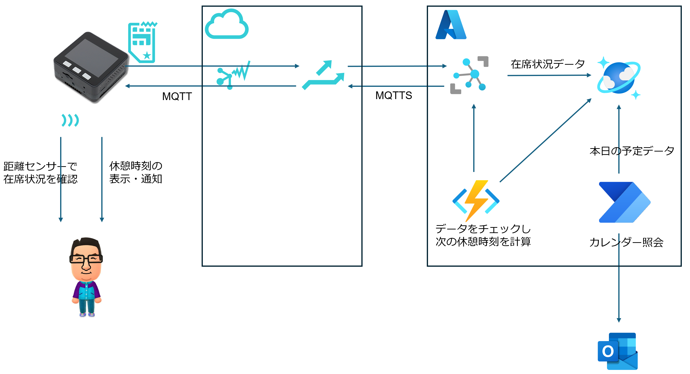
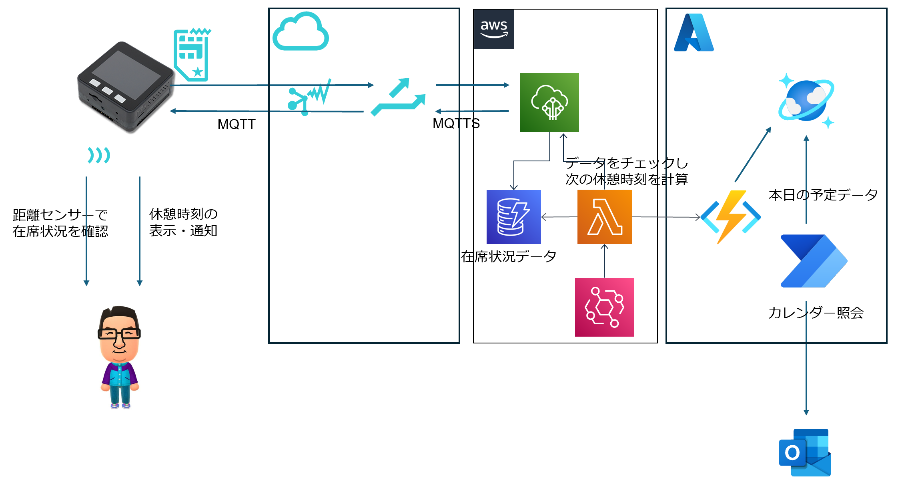

# アーキテクチャ

## アーキテクチャ図

Azure版  

AWS版  

## 構成要素

### 共通
- M5Stack Basic
  - 距離センサーで対象者の存在をチェックする
  - SORACOM ArcでWifiを利用してSORACOMに接続する
  - SORACOM BeamにMQTTでセンサーデータをpublishする
  - SORACOM BeamにMQTTでサブスクライブし、受信した次の休憩開始時刻を表示する
- SORACOM
  - SORACOM Arcで接続されたM5Stack Basicからセンサーデータを取得する
  - SORACOM BeamがデータをMQTTで受信してAzure IoT HubまたはIoT CoreにMQTTSでpublishする
  - SORACOM BeamがsubscribeしたIoT HubまたはIoT Coreからデータを取得し、MQTTでM5 Stack Basicに送信する
- Microsoft Azure
  - Cosmos DBは本日の予定データを保存する
- Power Automate
  - 平日の毎日9時に起動し、Microsoft365のOutlookに接続して当日の予定データを取得し、Cosmos DBに保存する

### Azure版
- Microsoft Azure
  - IoT HubがMQTTSでSORACOM Beamからセンサーデータを取得する
  - IoT Hubは受信したデータをCosmos DBにルーティングする
  - Cosmos DBはセンサーデータと本日の予定データを保存する
  - FuncitonsのtimerTrigger関数が平日の9時～18時の間5分おきに起動する。Cosmos DBのデータを取得し、ルールに基づいて次の休憩時刻を算出し、IoT HubのCloud2Device Message機能を用いてSORACOM Beamに送信する

### AWS版
- Amazon Web Services
  - IoT CoreがMQTTSでSORACOM Beamからセンサーデータを取得する
  - IoT Coreは受信したデータをDynamoDBに保存する
  - DynamoDBはセンサーデータを保存する
  - LambdaのtimerTrigger関数が平日の9時～18時の間5分おきに起動する。センサーデータをDynamoDBから、今日の予定データをAzure Functions(HTTP呼び出し)から取得し、ルールに基づいて次の休憩時刻を算出し、IoT CoreにPublishする
- Microsoft Azure
  - Cosmos DBは本日の予定データを保存する
  - FuncitonsのhttpTriggerはHTTPリクエストを受け取り、Cosmos DBに保存されている本日の予定データを返す

(*)Microsoft365のデータの取得はPower Automateを利用しているため、予定データはAWS版でもAzure Cosmos DBに保存しており、Azure FunctionsのHTTPトリガーを使って取得用APIを準備している。

# 次の休憩時間の計算方法

## ルール

  - 最後の休憩から workDuration 分後に休憩を取る
  - イベントの間は休憩を取らず、イベント終了後に休憩を取る
  - イベント終了後まで働くとworkDuration * 2 分以上仕事をすることになる場合は、イベントの前に休みを取る
  - イベント前に休もうとしたが前のイベントとの間がbreakDurationより短い場合は前のイベントの終了時刻から休憩を取る
  - 計算した結果、休憩開始時刻が現在時刻よりも前になった場合は現在時刻を休憩開始時刻とする
  - 一定時間より長いスケジュールは計算の対象外とする

## 例

workDuration = 30分、breakDuration = 5分、つまり30分ごとに5分の休憩を取るようにする。

- 現在時刻は10:20。最後の休憩終了は10:00
  - 次の休憩開始時刻は10:30
- 現在時刻は10:20。最後の休憩終了は10:00
  - 次の休憩開始時刻は10:30だが、10:30-10:35に会議が入っている
  - 会議が終わる10:35を次の休憩開始時刻とする
- 現在時刻は10:20。最後の休憩終了は10:00
  - 次の休憩開始時刻は10:30だが、10:30-11:00に会議が入っている
  - 会議が終わる11:00を次の休憩開始時刻とすると、1:00働いてしまう(>= 30分 x 2)
  - 会議開始前に5分の休憩を取るために、次の休憩開始時刻を 10:25 とする
- 現在時刻は10:20。最後の休憩終了は10:00
  - 次の休憩開始時刻は10:30だが、10:30-11:00に会議が入っている
  - 会議が終わる11:00を次の休憩開始時刻とすると、1:00働いてしまう(>= 30分 x 2)
  - 会議開始前に5分の休憩を取るために、次の休憩開始時刻を 10:25とする
  - しかし、10:00-10:26まで会議のため次の休憩開始時刻を10:26とする
- 現在時刻は10:27。最後の休憩終了は10:00
  - 次の休憩開始時刻は10:30だが、10:30-11:00に会議が入っている
  - 会議が終わる11:00を次の休憩開始時刻とすると、1:00働いてしまう(>= 30分 x 2)
  - 会議開始前に5分の休憩を取るために、次の休憩開始時刻を10:25とする
  - 10:25は既に過ぎているので次の休憩開始時刻を10:26とする
